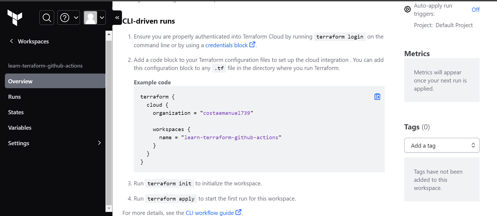
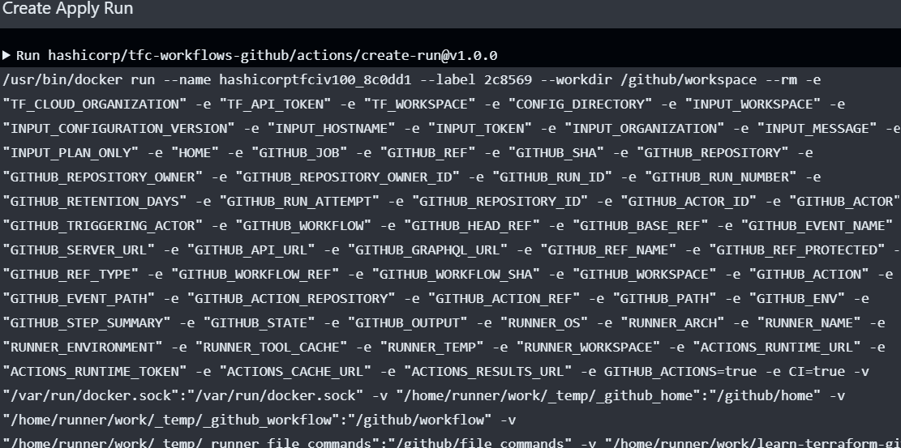
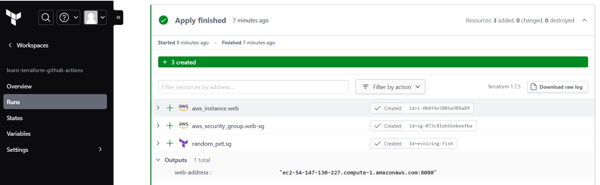
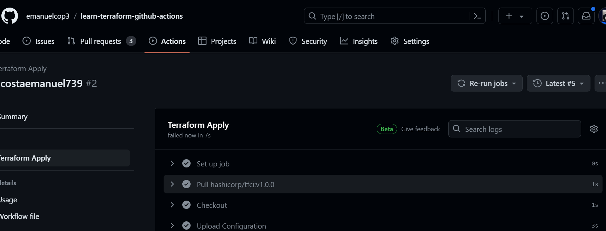

# Automate Terraform with GitHub Actions

This repo is a companion repo to the [Automate Terraform with GitHub Actions tutorial](https://developer.hashicorp.com/terraform/tutorials/automation/github-actions).

# Relatório: Automatizando o Provisionamento de Infraestrutura com Terraform e GitHub Actions

## Introdução

Neste relatório, vou compartilhar minha experiência ao explorar a integração entre o Terraform e o GitHub Actions para automatizar o provisionamento de infraestrutura na AWS (Amazon Web Services). O Terraform é uma ferramenta de código aberto da HashiCorp que permite definir, alterar e versionar infraestrutura de forma segura e eficiente. Por sua vez, o GitHub Actions é um serviço de automação baseado em eventos integrado ao GitHub que me permitiu criar fluxos de trabalho personalizados para automação de tarefas de desenvolvimento.

## Tecnologia Utilizada

- **Terraform**: Uma ferramenta que me possibilitou definir a infraestrutura como código, gerenciando recursos na nuvem de maneira eficiente e declarativa.
- **GitHub Actions**: Um serviço que me permitiu criar fluxos de trabalho personalizados com base em eventos do GitHub, como pushs de código, pull requests, entre outros.
- **AWS (Amazon Web Services)**: Um provedor de serviços em nuvem líder de mercado, que me ofereceu uma ampla gama de serviços para hospedagem de aplicativos, armazenamento de dados, redes, entre outros.

## Conceitos Aprendidos

### Terraform

- **Infraestrutura como Código (IaC)**: Com o Terraform, aprendi a definir e gerenciar a infraestrutura de forma programática, por meio de configuração em arquivos de texto.
- **Declaratividade**: Ao descrever a infraestrutura com Terraform, aprendi que posso focar no estado desejado da infraestrutura, deixando o Terraform entender as mudanças necessárias para alcançar esse estado.
- **Recursos e Provedores**: Descobri que no Terraform, os recursos representam componentes de infraestrutura, como instâncias EC2 ou bancos de dados RDS, enquanto os provedores são responsáveis por gerenciar esses recursos em serviços específicos, como o provedor AWS.
- **Planos e Aplicação**: Antes de efetivamente aplicar as mudanças na infraestrutura, aprendi que o Terraform gera um plano que mostra quais ações serão realizadas. Isso permite revisão e validação antes da aplicação efetiva das alterações.

### GitHub Actions

- **Fluxos de Trabalho (Workflows)**: Com o GitHub Actions, descobri que posso definir fluxos de trabalho em arquivos YAML, consistindo em uma série de etapas que são executadas em resposta a eventos específicos.
- **Integração Contínua (CI)**: Utilizando o GitHub Actions, pude configurar pipelines de Integração Contínua, onde as alterações de código são automaticamente testadas e validadas, ajudando a identificar erros rapidamente.
- **Implantação Contínua (CD)**: Além da Integração Contínua, aprendi que o GitHub Actions também suporta a Implantação Contínua, permitindo a automação do processo de implantação de aplicativos em ambientes de produção após a conclusão dos testes.

## Etapas de Execução

### Terraform Plan Workflow

1. **Checkout**: A primeira etapa é realizar o checkout do repositório.
  

2. **Upload Configuration**: A configuração do Terraform é carregada para o Terraform Cloud e marcada como especulativa.

3. **Create Plan Run**: Cria uma execução de plano especulativo no Terraform Cloud.

4. **Get Plan Output**: Extrai a saída do plano da execução especulativa.

5. **Update PR**: Adiciona um comentário à solicitação pull com um link para a execução no Terraform Cloud e remove comentários anteriores.

### Terraform Apply Workflow

1. **Checkout**: Realiza o checkout do repositório.
  

2. **Upload Configuration**: Carrega a configuração do Terraform para o Terraform Cloud.

3. **Create Apply Run**: Cria uma execução de aplicação do Terraform usando a configuração carregada.
  

4. **Apply**: Confirma e aplica a execução.
  
 ## Prints das execurções 
#### Configuração terraform
  </img>

  </img>
   </img>
 #### Github Actions workflow
   </img>

## Conclusão 

A integração entre o Terraform e o GitHub Actions oferece uma solução poderosa para automatizar o provisionamento e gerenciamento de infraestrutura na nuvem. Ao utilizar o Terraform para definir a infraestrutura como código e o GitHub Actions para automatizar o ciclo de vida de desenvolvimento, as equipes podem alcançar uma infraestrutura mais confiável, escalável e repetível assim como estamos implementando no projeto do grupo para o parceiro, ao mesmo tempo que reduzem o tempo e esforço necessários para gerenciar a infraestrutura manualmente. Essa abordagem também promove a colaboração entre equipe de desenvolvimento e operações, facilitando a entrega de software de maneira mais rápida e eficiente.
